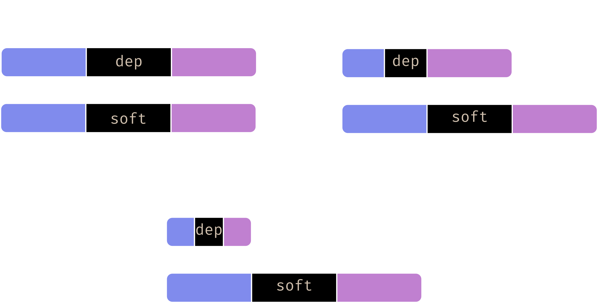

% Nix for particle accelerators, and the adventure in cross-compilation
% Rémi NICOLE
% 20-10-2022

---
slide-level: 2
aspectratio: 169

theme: metropolis
colortheme: owl

# Light theme
#colorthemeoptions: snowy
#minted:
#	style: perldoc

links-as-notes: true
beameroption: "show notes on second screen=right"

lang: en-US

citation-style: chicago-note-bibliography.csl

references:

- type: speech
  title: LLVM Toolchains in Nixpkgs
  author: John Ericson
  issued: 2021-09-16
  id: llvmNixpkgs
  url: https://www.youtube.com/watch?v=UMDRAmmDBgM
  genre: talk
  event: LLVM Distributor's Conf

- type: speech
  title: An introduction into cross-compiling with nixpkgs
  author: Jörg Thalheim
  issued: 2018-12-29
  id: nixosCross
  url: https://discourse.nixos.org/t/slides-from-my-35c3-cross-compile-workshop/1785
  genre: workshop
  event: 35C3

- type: webpage
  title: Raspberry Pi 4 Model B specifications
  container-title: Raspberry Pi
  issued: 2019-06
  id: rpi
  url: https://www.raspberrypi.com/products/raspberry-pi-4-model-b/specifications/

- type: webpage
  title: MacBook Pro (13-inch, 2019, Two Thunderbolt 3 ports) - Technical Specifications
  container-title: Apple
  issued: 2019-08
  id: macbook
  url: https://support.apple.com/kb/SP799

- type: speech
  title: A new ABI for little-endian PowerPC64 Design & Implementation
  author: Dr. Ulrich Weigand
  issued: 2014-04-08
  id: ppcelfv2
  url: https://www.youtube.com/watch?v=zikDZ1Fi-qw
  genre: talk
  event: EuroLLVM

nocite: "@*"
---

# What is cross-compilation?

## People can't seem to agree

Different workload types, different CPUs, different machine code.

---

:::::: {.columns align=center}

::: column
![`aarch64-linux`  
([@rpi])](./imgs/raspi.png){align=center}
:::

::: column
![`x86_64-darwin`  
([@macbook])](./imgs/macbook.jpg){align=center}
:::

::::::


::: notes

Both of these architectures are considered "Tier 2" for support in nixpkgs

:::

## Definition

Cross-compilation:
: Compiling a package from a given system, for a different system

::: notes
We might do that due to:

- performance issue: a Raspberry Pi doesn't have same computation power or
  memory than a development laptop.
- availability issue: we might want to compile something for Windows without
  having access to one
:::

## Why is it special?

```{.console linenos=false}
user@pc ~ % gcc test.c
```

. . .

```{.console linenos=false}
user@pc ~ % aarch64-linux-gcc test.c
```

```{.console linenos=false}
user@pc ~ % x86_64-darwin-gcc test.c
```

## Why is it special?

```{.console linenos=false highlightlines=1}
user@pc ~ % x86_64-linux-gcc test.c
```

```{.console linenos=false}
user@pc ~ % aarch64-linux-gcc test.c
```

```{.console linenos=false}
user@pc ~ % x86_64-darwin-gcc test.c
```

## Build systems can be complicated

### Running the build

Build systems needs to be run on the build machine

. . .

### Configuring

Tools for finding dependencies need to run on the build machine

. . .

### Building

Tools that generates code need to run on the build machine

. . .

### Testing

Tests need to run on the build machine

::: notes

- Build systems, like `autotools`, `cmake`, `meson`
- For configuring, the most notable one is `pkg-config` which generically finds
  libraries and compilation options for dependencies.
- But other tools exist, for example `llvm-config`, which is specific to LLVM.
- For building, compilers are the most notable, but we can also have tools like
  in wayland or protobuf, which generates C code from protocol description
  files.
- And for compilers the compiler must be configured so that the binary code
  that it generates runs on the platform we're interested in.
- And also, you have a lot of exception, lots of handmade build systems which
  can complicate packaging

:::

# Cross-compilation with Nix

## Platform types

```{=latex}
\definecolor{build}{HTML}{808bed}
\definecolor{host}{HTML}{cfbfad}
\definecolor{target}{HTML}{c080d0}
```

-----------------------------------------------------------------------------------------------------
\textcolor{build}{Build Platform} \textcolor{host}{Host Platform} \textcolor{target}{Target Platform}
--------------------------------- ------------------------------- -----------------------------------
Platform building the software    Platform running the software   Platform for which the software generates code (for e.g. `gcc`)
-----------------------------------------------------------------------------------------------------

[@nixosCross]  
[@llvmNixpkgs]

::: notes
- Host platform generally is the platform that's the most interesting to you
- Taken from Autotools terminology (de-facto standard)
- Some other software use a different terminology, which makes things confusing
- Graphics adapted from talk [@llvmNixpkgs]
:::

---

{width=70%}

## Specifying dependencies in Nixpkgs

TODO: separate the three thingies

{width=70% align=center}

. . .

`deps${HOST}${TARGET}`{.bash}

::: notes

Those three are the most common, especially `buildInputs` and
`nativeBuildInputs`, but you can find some special cases. For example, the
`gcc` package also uses `depsBuildTarget` and `depsTargetTarget`.

:::

## Actually compiling stuff (quick version)

```nix
pkgs.pkgsCross.raspberryPi.hello
```

. . .

Systems configured for you (with $\varheartsuit$):

```nix
lib.systems.examples
```

::: notes
This will get you a single package, cross-compiled for Raspberry Pi 1, that you
can then upload to a running Raspberry Pi
:::

## Actually compiling stuff (expert version)

```{.nix fontsize=\small}
(import nixpkgs {
  localSystem = "x86_64-linux";
  crossSystem = {
    system = "powerpc64-linux";
    linux-kernel = {
      baseConfig = "ifc1410_defconfig";
      # ...
    };
    gcc = {
      cpu = "e6500";
      abi = "elfv2";
    };
  };
}).hello
```

::: notes
If you just want to compile individual packages, you usually need to specify
only `system`.
:::

## Cross-compiling whole NixOS images

```nix
# Insert this in you NixOS configuration:
{
  nixpkgs.crossSystem = lib.systems.examples.raspberryPi;
  # And maybe:
  nixpkgs.config.allowUnsupportedSystem = true;
}
```

. . .

And then use something from `config.system.build`.

::: notes
This can be used to generate just the file system, the kernel, the initramfs,
an SD card image, etc.

If you're interested, there is Linus Heckemann's talk "NixOS can live anywhere"
:::

# How hard can it be?

## Context (project)

We have some acquisition boards, which continuously acquires data about the
electromagnetic current generated by a beam.

This data is then displayed to operators, who can use this value to check if
beam is in good shape.

TODO: add picture of ACCT

## Context (hardware)

Board:
: IFC1410 from IOxOS

Architecture:
: `powerpc64` (Big Endian)

Storage:
: None

::: notes
Unfortunately, I can't tell everything about the context.

It actually has some persistent storage, but it's not meant for storing an OS
:::

## Context (software)

Acquisition software:
: Already packaged using Nix

Image builder that was used:
: Yocto

::: notes
We intended to use Nix to package only our software, and not use NixOS

But since we don't have persistent storage, and our previous network boot
solution had reliability issues, I decided to try using NixOS

If NixOS is too complicated, we'll fallback to something more simple, and
deploy just the acquisition software using Nix
:::

## Yocto issues

TODO: keep?

- Yocto works in layers (think: overlays)
- We have a layer for our board
- Our layer have dependencies on other layers
- Depencies are not listed
- Depencies versions are not documented

::: notes
Yocto layers contain mainly packages and image types, but can also modify
packages from other layers.

I had to start from the latest version of Yocto, see that our layer was not
compatible with that, modify our layer to make it compatible, see that the
manufacturer's kernel is so old that it needs an old version of GCC, figure out
which version of Yocto uses which version of GCC, change the version of all
layers, update software for the Nix package that I'm creating...
:::

## Minimal NixOS configuration

```nix
{ lib, ... }: {
  # Removes some default things
  imports = [ (modulesPath + "/profiles/minimal.nix") ];

  nixpkgs.crossSystem = lib.systems.ppc64;
  nixpkgs.config.allowUnsupportedSystem = true;

  # Do the stable version
  system.stateVersion = "22.05";
}
```

::: notes
The "minimal" profile removes things like documentation and makes it so that
some packages are built without graphical support.
:::

---

Oh god

. . .

Ooh, am I trying to compile the Rust compiler?

::: notes
On a side note: if you are trying to cross-compile a whole NixOS system, be
prepared to have some computing power, and a lot of time.
:::

## Packages that didn't compile

`nix build '--keep-going'`{.bash}

. . .

### Failures:{.alert}

nettle
: A cryptography library

kexec-tools
: Tools for Linux's "kexec" feature

linux
: The kernel

rustc
: The Rust compiler

## Nettle build output

```
ld: gcm-hash.o: ABI version 1 is not compatible with ABI version 2 output
ld: failed to merge target specific data of file gcm-hash.o
ld: aes-encrypt-internal-2.o: ABI version 1 is not compatible with ABI version 2 output
ld: failed to merge target specific data of file aes-encrypt-internal-2.o
...
```

. . .

rustc has similar errors

## kexec-tools build ouput

```
cc1: error: '-mcall-aixdesc' incompatible with '-mabi=elfv2'
```

## linux build output

```
> {standard input}:2491: Error: unrecognized opcode: `wrteei'
> {standard input}:4305: Error: unrecognized opcode: `wrteei'
```

## The history of powerpc64 (in 1 slide)

#. The powerpc64 architecture: *exists*
#. gcc defaults to the ELFv1 ABI
#. IBM started the powerpc64le architecture
#. IBM saw an opportunity to create a new ABI (ELFv2)
#. IBM made the ABI orthogonal to endianness
#. gcc now defaults the ELFv2 ABI, only on little-endian
#. The End

[@ppcelfv2]

## Implications

- gcc defaults ELFv1 for powerpc64 (big-endian)
- gcc defaults ELFv2 for powerpc64le (little-endian)

. . .

- Some projects assume big-endian *implies* ELFv1
- Some other projects *requires* ELFv2 to work

. . .

- NixOS configures big-endian with ELFv2

::: notes
The status-quo makes it so that if I try powerpc64 with ELFv1, some project
breaks, and with ELFv2 some other project breaks
:::

---

**\textcolor{red}{nettle}**, **\textcolor{red}{kexec-tools}**, and
**\textcolor{red}{rustc}** makes the wrong assumption that ELFv1 is going to be
used.

. . .

**\textcolor{red}{linux}** is, huh... Let's talk about that later...

## Void Linux to the rescue

Some other distributions (Void Linux, FreeBSD, ...) pushes for ELFv2

Thanks to Ryan Burns for pushing me in the right direction!

::: notes
Let's yoink the patches from Void Linux, and with that, nettle and kexec-tools
work!

Not rustc, though, let's find a way to remove the dependency
:::

## Closure debugging time!


# Workarounds in practice

## An slide

Much content

# Conclusion

## Overall opinion

It took some effort to get there, but:

- It works well
- It's reproducible, configurable, yadi yada...
- The code is clear (I think)
- The whole store is compressed!
- Most issues arose from the (quite old) `powerpc64` big-endian architecture
- And the friggin' `binutils` issue

## Things that were a bit hard with Nix (but just a bit)

- How to add a custom kernel
- How to add custom kernel configurations and DTBs
- Actually compiling DTBs for the powerpc architecture
- The U-Boot netboot
- Removing some unneeded filesystems / grub

::: notes
To be fair, I haven't communicated that much on these issues, but sitting down
for creating this presentation gave me a good excuse for listing them

The reproducibility of Nix isn't a myth, the screenshot of errors I showed you
are very recent: since this is a flake project I just took an old commit,
commented out the workarounds, and I could see all the old errors that I had.
:::

# Bonus: Network boot

## An slide

Much content

## Bibliography
